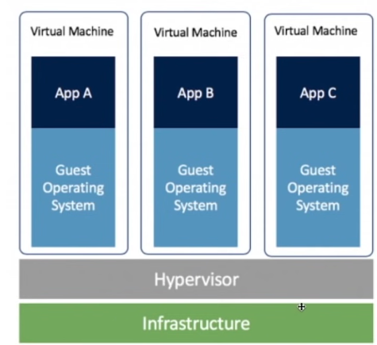
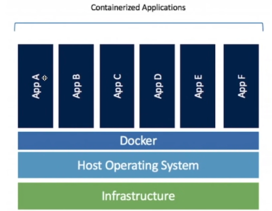
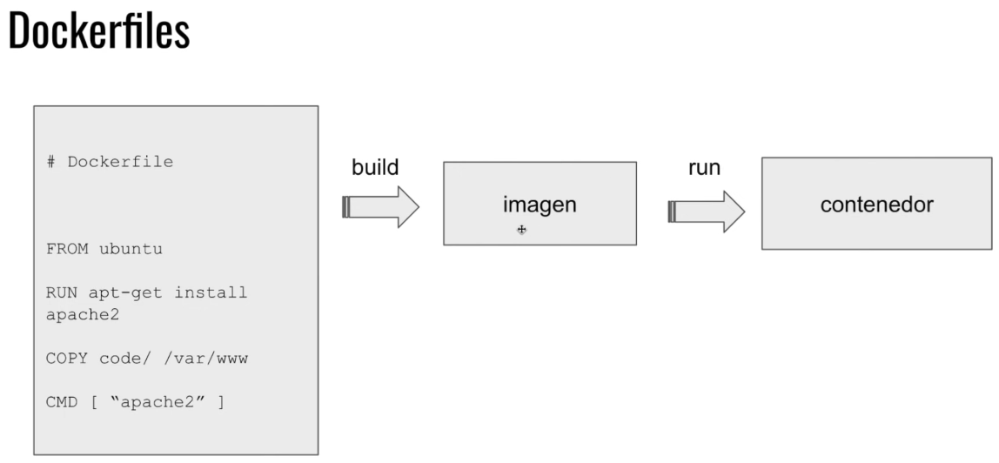

- How to [install Docker](https://docs.docker.com/get-docker/)
- Difference between Docker and VMs (Virtual Machines)









- Docker images and `docker run` 
```
docker run postgres
docker run postgres -e POSTGRES_PASSWORD=password postgres
docker run postgres -e POSTGRES_PASSWORD=password postgres:9.6
```
**NOTE**: Always use tags!
- Common Docker commands
  - `docker images`
  - `docker ps`
  - `docker start [container name/id]`
  - `docker logs [container name/id]`
  - `docker exec` (use this to connect to your docker container)
  - `docker run -d`

- Development in Docker
- Writing a Docker manifest, `Dockerfile`
- Build an image from a `Dockerfile` using `docker build` (always use tags)
- Using ports in Docker `docker run -d -v /tmp/example/app/etc:/etc/todos -p 3000:3000 [image:version]`
- Volumes in Docker
- `docker build` and `docker push`
- Running various docker containers
- `docker-compose`
- Q&As

https://12factor.net/